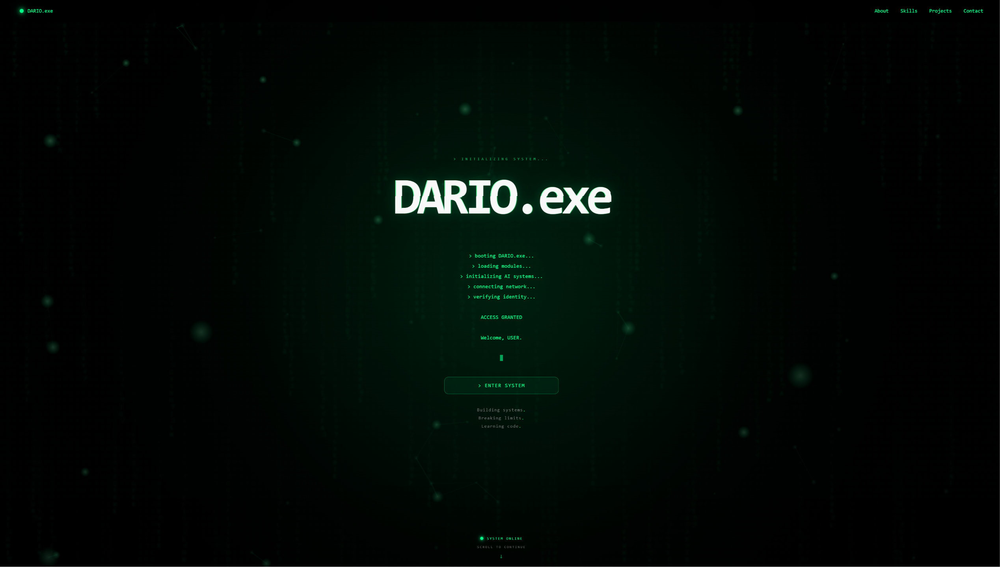
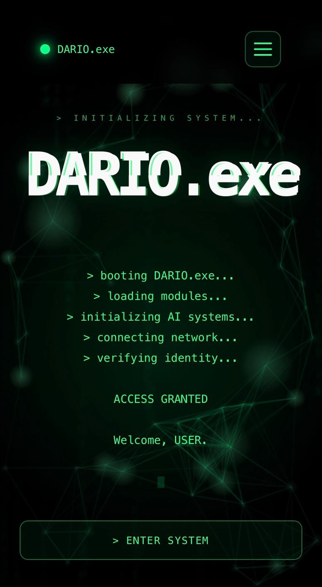

# DARIO.exe

> Building systems. Breaking limits. Learning code.

## Project Description

DARIO.exe is my personal developer portfolio, designed as a futuristic system interface inspired by cyberpunk, terminal and Matrix-style visuals.

The website presents my background in industrial automation, my growing experience in software development and cybersecurity, and the projects I have built during my learning journey.

DARIO.exe was created to strengthen my frontend development skills and to serve as a central place where I can document my progress, showcase my work and build my personal developer identity.

The website includes animated sections, interactive navigation, project cards, skill indicators, a contact terminal and several small system-inspired effects.


## Features

- Futuristic cyberpunk and terminal-inspired design
- Animated hero section with typing effects
- Sticky navigation bar with active section highlighting
- Smooth scrolling between page sections
- Scroll progress indicator
- Animated skill bars using native CSS and JavaScript
- Interactive project cards with GitHub links
- Responsive layout for desktop, tablet and mobile devices
- Contact terminal powered by EmailJS
- Spam protection for repeated contact form submissions
- Return-to-system button with animated status messages
- Matrix-style background animation
- Particle background effects
- Custom loader animation
- Privacy Policy page
- Version number and copyright information in the footer

## Browser Compatibility

The navigation includes explicit scroll-restoration and URL-anchor handling
for refresh and pull-to-refresh behaviour on mobile browsers.

## Project Structure

```text
Website-Dario/
├── index.html          # Main portfolio page
├── 404.html            # Custom error page
├── privacy.html        # Privacy Policy
├── css/                # Stylesheets for layout and components
├── js/                 # JavaScript animations and interactions
├── assets/             # Images and website screenshots
├── CNAME               # Custom domain configuration
├── CHANGELOG.md        # Version history
├── LICENSE.md          # Copyright and usage terms
└── README.md           # Project documentation
```


## Installation and Local Usage

DARIO.exe is a static website built with HTML, CSS and JavaScript. No package installation or build process is required.

### 1. Clone the repository

```bash
git clone https://github.com/MidnightHawkEye/Website-Dario.git
```
### 2. Open the project folder

```bash
cd Website-Dario
```

### 3. Start the website locally

Open the project in Visual Studio Code and start `index.html`
using the Live Server extension.

Alternatively, `index.html` can be opened directly in a modern
web browser. Using a local development server is recommended.

### Requirements

- A modern web browser
- An internet connection for EmailJS contact-form delivery
- Visual Studio Code with Live Server is recommended

### Contact Form

The contact form uses EmailJS. A valid EmailJS public key,
service ID and template ID are required for message delivery.

## Technologies and Libraries

### Core Technologies

- **HTML5** – Structure and semantic content
- **CSS3** – Layout, responsive design, animations and visual styling
- **JavaScript (ES6+)** – Interactions, navigation, animations and form logic

### Libraries and Services

- **CSS animations and transitions** – Interface motion and visual feedback
- **Intersection Observer API** – Scroll-based animation triggers
- **Canvas API** – Matrix and particle effects
- **EmailJS** – Contact form message delivery

### Development and Deployment

- **Git** – Version control
- **GitHub** – Repository hosting and project management
- **GitHub Pages** – Website deployment and hosting
- **Visual Studio Code** – Development environment
- **Live Server** – Local development server
  
## Preview

### Desktop



### Mobile



### Live Demo

[Open DARIO.exe](https://dario-exe.ch)

## License and Copyright

Copyright © 2026 Dario Hasler. All rights reserved.

This repository is publicly accessible for viewing and educational
reference purposes only. Copying, modifying, distributing or reusing
this project without prior written permission is not permitted.

For further information, see the [LICENSE.md](LICENSE.md) file.
